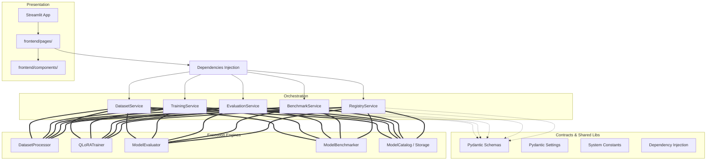

# LLMOps Studio System Architecture

This document describes the foundational software architecture of **LLMOps Studio**.

---

## 1. Multi-Tiered Design Pattern

LLMOps Studio implements a clean separation of concerns:

---

## 2. Why Each Layer Exists

### Service Orchestration Layer (`backend/services/`)
- **Isolation of Business Logic**: The presentation client (Streamlit) has no direct access to dataset preprocessing details, training loops, or evaluations scripts. It queries intermediate Service controllers.
- **Client Decoupling**: If the project pivots from Streamlit to a React/Next.js frontend in future phases, the core orchestrators (`DatasetService`, `TrainingService`) remain untouched. We only need to expose them via a REST layer (e.g. FastAPI).

### Schema Exchange Layer (`backend/schemas/`)
- **Strict Data Contracts**: Establishes typing standards using Pydantic.
- **Type Coercion & Validation**: Prevents bad inputs (such as training epochs = "many" or negative learning rates) before hitting the execution routines.
- **REST/JSON Readiness**: These schemas serialize directly into FastAPI request/response JSON payloads.

### UI Isolation (`frontend/pages/` and `frontend/components/`)
- **No Side Effects**: Individual views only render visual widgets. State updates and data mutations are delegated back to the Service layer.
- **Shared Widgets**: Visual components (like metric cards, alerts, logs viewer boxes) sit in `components/` for consistency.

### Integrations Layer (`backend/integrations/`)
- **Adapter Pattern**: Third-party drivers (HuggingFace API calls, Weights & Biases telemetry logs) are kept outside core models. Changing tracking providers (e.g., from W&B to MLflow) requires editing only the W&B integration adapter without breaking core training services.

---

## 3. Scalability & Maintainability

- **Horizontal Scalability**: Heavy computing steps (QLoRATrainer, ModelEvaluator) can run on distinct GPU worker nodes because tasks communicate using Pydantic exchange payloads.
- **Testing**: Test suites execute on backend schemas and services directly without launching browser rendering contexts.
